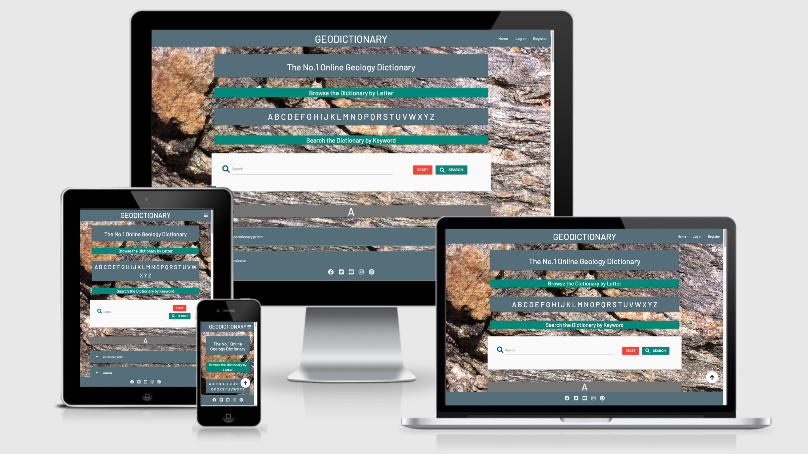
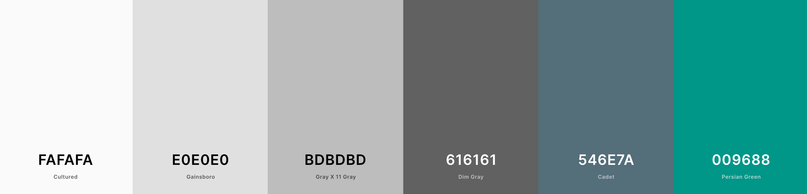

# Milestone 3 Project - Geodictionary



# Table of Contents

> - [Overview](#overview)
> - [User Stories](#user-stories)
> - [UX](#ux)
> - [Features](#features)
> - [Technologies Used](#technologies-used)
> - [Resources for learning](#resources)
> - [Testing](#testing)
> - [Project barriers and solutions](#project-barriers-and-solutions)
> - [Code validity](#code-validity)
> - [Version Control](#version-control)
> - [Deployment](#deployment)
> - [Credits](#credits)
> - [Acknowledgments](#acknowledgments)
> - [Support](#support)

Site deployed on Heroku [HERE](https://geodictionary-ms3.herokuapp.com/)

**Please note: To open any links in this document in a new browser tab, please press `CTRL + Click`.**

## Overview

The aim of this project is to create a comprehensive geology and earth sciences dictionary that provides a resource that is accessible and visually appealing to all experience levels from geology experts, to experienced amateurs, through to complete beginners. Interested users can register with the site, allowing them to add new terrms and definitions and edit their own entries. A search facility allows users to search existing terms and definitions

> [Back to Top](#table-of-contents) 

## User Stories

### Users

- As a user I want to be presented with a simple, enjoyable and easy to use site, that is also visually appealing
- As a user I want to be able to navigate around the site with ease
- As a user I want to be able to easily find the geological term I am looking for, via an alphabetical ordering system
- As a user I want to be able to easily find the geological term I am looking for, via a search form
- As a user I would like the option to add to the dictionary of geological terms
- As a user I want to have access to the geological terms/definitions that I have previously created and have the option to edit them
- As a user I want to enjoy using the site enough to want to return
- As a user, going forward I would like to be able to interact with other users on the site on a social level
- As a user, going forward I would like to be able to see recommendations for geological themed merchandise, trips etc

### Admin

- As an admin I would like the ability to **log into an admin account**, so that I can curate and maintain the contents of the site
- As an admin user I would like the ability to track the activity of registered users so I can monitor the suitability of information being added to the dictionary
- As an admin I would like to be able to delete user accounts, so that I can maintain control of user accounts
- As an admin I would like to be able to update all terms and definitions so that I can ensure the site is kept relevant, factually correct and visually appealing for all users

## UX

This website project will target geology enthisiasts of all levels. The main focus is on providing a fluid and structured dictionary of as many geology and earth science terms and definitions as possible

### 1. Strategy

#### Project and User Goals

- Provide an easy to navigate dictionary for cataloguing geology and earth science terms and associated definitions

- Provide new user accounts to enable users to login and access the dictionary
- Provide an admin account to enable an admin to login and manage the site
- Design backend functionality focussed on defensive design

- Design frontend UX for:
  - Clean and intuitive navigation
  - Responsiveness for use on mobile phone and tablet devices

### 2. Scope

- Project utilises my current coding skill-set of HTML, CSS, JavaScript, Python, Flask and MongoDB
- Allow users to add new content
- Allow users to amend content which they previously added
- Allow users to search existing content
- Allow users to read existing content
- Allow Admin to create, Read, Update and Delete content

### 3. Structure

The overall structure is designed for ease of navigation to each section

- The first page that is presented to the user is the Home page. Here users will encounter a site tagline, a browse by letter section, a search by keyword section and all existing terms, sorted into alphabetical sections
- The Navigation bar is located across the top of the Home page. The logo is located centrally within the navigation bar, with all navigation links located to the right. The links are Home, Login, Add Term and Profile
- On smaller screens sizes the navigation menu translates to a side configuration containing the same links as the top navigation menu
- The alphabetical sections include href links which enable users to navigate to gelogy terms beginning with the particular letter that the user clicks
- The dictionary is displayed with terms below their relevant alphabetical letter. Each section is headed by a large, corresponding letter
- The geology term is contained within the header section of a collapsible. When clicked and collapsed, the definition will be displayed within the body section of the collapsible. The name of the user who created the entry will also be displayed here
- The second navigation link directs users to the Log In page. The Log In page contains a form allowing existing users to log in to their profile.
- The third navigation link directs users to the Register page. The Register page contains a form allowing new users to resister a new account
- When a user is logged in to their profile, the Add Term link will appear as a fourth link in the navigation bar. This link will direct registered users to the Add Term and Definition form where new terms and definitions can be added to the dictionary
- When a user is logged in and within the home page they will have the ability to edit their own entries. An Edit button will been seen next to every term that they have previously added to the dictionary. Clicking on this button will direct the user to an 'Edit Term and Definition' form where the term and difinition can be updated
- Users who are logged in can also navigate to their profile page using the Profile link in the navigation bar. Here users will see a message about the purpose of the site and how they can contribute
- Users who are logged in will also see a Logout link in the navigation bar to allow them to log out

### 4. Skeleton

- Navigation bar - When user is not logged in a menu with links pointing to the Home page, the Login page and the Register page. When a user is logged in a menu with links pointing to the Home page, the Profile page, the Add Term page and the logout link
- Home Page - A navigation bar at top of page with functionality as described above. An intro headline, an alphabet menu for browsing alphabetically sorted terms and definitions. A search form to search the dictionary by keyword(s). A footer with social media links fixed to the bottom of the page
- Register Page - A navigation bar at top of page with functionality as described above. A Form with fields to create new user and user password. A footer with social media links fixed to the bottom of the page 
- Login Page - A navigation bar at top of page with functionality as described above. A form with fields for user and password. A footer with social media links fixed to the bottom of the page.
- Add Term Page - A navigation bar at top of page with functionality as described above. A form with 'Add Term' and 'Add Definition' fields. A footer with social media links fixed to the bottom of the page
- Edit Term Page - A navigation bar at top of page with functionality as described above. A form allowing users to edit their own dictionary entries. A footer with social media links fixed to the bottom of the page
- Profile Page - A navigation bar at top of page with functionality as described above. A banner showing user name of currently logged in user and a description of the purpose of the site and how users can contribute. A footer with social media links fixed to the bottom of the page

- Wireframes for mobile phones, tablets and desktops can be found here [Wireframes](static/wireframes/all-wireframes.pdf)

### 5. Surface

The overall UX is clean and consistent and offers the user a site which should be easy to navigate and a pleasure to use, encouraging users to return multiple times. I utilised the Materialize material design bootstrap framework to achieve this

#### Colours

The colour pallette was chosen to reflect colours which are typical within the matrix of geological features and rocks 

[Colour Palette - Coolors.co](https://coolors.co/fafafa-e0e0e0-bdbdbd-616161-546e7a-009688)


#### Typography

- Main font for the site is "Barlow" (with fall-back font of Sans-Serif) which is used for heading and body content

#### Images

- I have chosen to only use a single image with this project. The image, which is a rock texture image, has been utilised as a background image for each page

#### Design Choices

- As the project developed, the look and layout began to deviate slightly away from my initial wireframe designs. The core design is still similar with extra links, pages etc added

> [Back to Top](#table-of-contents)

## Features

### Existing Features

- Designed with HTML5, CSS3, JavaScript, Python3, Flask, MongoDB and Materialize
- Responsive Materialize Bootstrap Navigation bar
- Home/Landing page with redirection links to Register page and Login page

### Features Left to Implement

- Integrate functionality to the Add Terms form to allow users to upload photographs when submitting new terms and definitions
- Create functionality to allow a site administrator to curate and manage all terms, definitions and perform all other administrative tasks
- Add links to relevant external sites which can provide additional information on terms within the dictionary
- Add social channels to allow communication between users
- Add links to merchandise and trip websites
- Add all Admin features detailed within my User Stories


> [Back to Top](#table-of-contents) 

## Technologies Used

### 1. Languages

 [HTML5](https://en.wikipedia.org/wiki/HTML5)

 [CSS3](https://en.wikipedia.org/wiki/Cascading_Style_Sheets)

 [JavaScript](https://en.wikipedia.org/wiki/JavaScript)

 [Python](https://en.wikipedia.org/wiki/Python_(programming_language))

### 2. Integration

 [Materialize](https://materializecss.com/) - by linking via [Materialize CDN](https://materializecss.com/getting-started.html) to HTML Doc

 [FontAwesome](https://fontawesome.com/) Icons for Social Media links

 [Google Fonts](https://fonts.google.com/) - Overall Typography import

 [jQuery](https://jquery.com/) - JavaScript library

 [Flask](https://flask.palletsprojects.com/en/1.1.x/) Micro web framework written in Python

 [MongoDB](https://www.mongodb.com/) NoSQL database program, using JSON-like documents

### 3. Dependencies

- [Pymongo](https://pypi.org/project/pymongo/) and [Flask-PyMongo](https://flask-pymongo.readthedocs.io/en/latest/) To connect Python and Flask to the MongoDB database
- [Werkzeug](https://werkzeug.palletsprojects.com/en/1.0.x/) WSGI (Web Server Gateway Interface) for Python
- [Jinja2](https://jinja.palletsprojects.com/en/2.11.x/) Templating language for Python
- [dnspython](https://www.dnspython.org/) DNS toolkit for Python
- [autopep8](https://pypi.org/project/autopep8/) Python Code formatter

### 4. Workspace, Version Control, Repository storage and Deployment

 [Gitpod](https://www.gitpod.io/) - Main workspace

 [Git](https://git-scm.com/) - Distributed Version Control tool to store versions of files and track changes

 [GitHub](https://github.com/) - A cloud-based hosting service to manage Git repositories

 [Heroku](https://heroku.com) - Container-based cloud platform for deployment and running of apps

### 5. IDE Extensions used

- Auto Close Tag
- Auto Rename Nametag
- Bracket Pair Colorizer 2
- Code Spellchecker
- Beautify - Code Formatter
- Indent-Rainbow
- Markdown Lint
- Python
- JSHint

> [Back to Top](#table-of-contents) 

## Resources for Learning

- [Code Institute Course Content](https://courses.codeinstitute.net/) - Main source of fundamental HTML, CSS, Javascript, Python, MongoDB and Heroku knowledge.
- Code Institute **SLACK Community** - Main source of assistance
- [Stack Overflow](https://stackoverflow.com/) - General resource.
- [Youtube](https://www.youtube.com/) - General resource.
- [CSS-Tricks](https://css-tricks.com/) - General resource.
- [W3.CSS](https://www.w3schools.com/w3css/4/w3.css) - General resource.
- [CommonMark](https://commonmark.org/help/) - For Markdown language reference.
- [Coolors.co](https://coolors.co/) - Colour pallette generator
- [TinyPNG](https://tinypng.com/) - Efficient compression of images for site.
- [Am I Responsive](http://ami.responsivedesign.is/) - Responsive website mockup image generator.
- [Balsamiq](https://balsamiq.com/wireframes/) - Wireframing design tool.

> [Back to Top](#table-of-contents) 

## Testing

Testing documentation can be found on a separate document [HERE](static/testing/TESTING.md)

## Project barriers and solutions

- My search function worked perfectly when searching for terms, when returning no results found, and when resetting the search. However, when a search term was returned, I found that, if it appeared in multiple terms, then these terms remained located under the div which contained each alphabetical letter. The effect I desired was for all returned terms to be filtered to the top, below the search form, so they could be easily viewed, and for the divs containing the alphabetical letters to be hidden. To achieve the desired effect I 

- The text 'Search' on the search button within the search form disappears on smaller screen sizes. To fix this problem I changed the text from 'Search' to 'Go'. I am sure there is a more technical way to fix this problem, but this solution proved sufficient in the circumstances

> [Back to Top](#table-of-contents) 

## Code validity

For full details on how the code was validated see the seperate testing document [HERE](static/testing/TESTING.md).

- HTML - [W3C](https://validator.w3.org/) - Markup Validation
- CSS - [W3C](https://jigsaw.w3.org/css-validator/) - Jigsaw CSS Validation
- JavaScript - [JSHINT](https://jshint.com/) - JavaScript code warning & error check
- Python - [Pyton Tester](https://extendsclass.com/python-tester.html) Python code syntax checker
- TAGS - [Closing Tag Checker for HTML5](https://www.aliciaramirez.com/closing-tags-checker/) - Validates all tags are opening and closing correctly.

## Version Control

- Used Git for version control.

### IDE

- All code was written on [Gitpod](https://www.gitpod.io/)
- The code was then pushed to GitHub where it is stored in my [Repository](https://github.com/sruss07/MS03-Geodictionary).

> [Back to Top](#table-of-contents) 

## Deployment

### Local Installation

#### 1. Cloning the project

- The code can be run locally through clone or download from the repository on [GitHub](https://github.com/sruss07/MS03-Geodictionary).
- You can do this by opening the repository, clicking on the Code' button and selecting either 'clone or download'.

    
- The Clone option provides a URL, which you can use on your CLI with `git clone <paste url>`.
- The Download ZIP option provides a link to download a ZIP file which can be unzipped on your local machine. The files can then be uploaded to your IDE.

#### 2. Create a Virtual Environment

In the Terminal window:

- Navigate to the folder of the installed files with `cd <path>`
- Create the virtual environment folder with `python -m venv venv`
- Activate the virtual environment with `venv\Scripts\activate.bat`

*Note: The above commands were used on Gitpod on Mac OS. For other IDE's and Linux, please refer to [Creation of Virtual Environments](https://docs.python.org/3/library/venv.html)*

#### 3. Create Environmental Variables

- Create an env.py file in the the **config** folder. In this file enter the Environmental Variables (**replace values with your own**) as follows:

```python
        import os

        os.environ.setdefault("IP", "IP_ADDRESS")
        os.environ.setdefault("PORT", "PORT")
        os.environ.setdefault("SECRET_KEY", "SECRET_KEY")
        os.environ.setdefault("MONGO_URI", "MONGO_URI")
        os.environ.setdefault("MONGO_DBNAME", "MONGO_DBNAME")
```

#### 4. Create a .gitignore file

- Create a file called **.gitignore** in the root directory and ensure it contains the following git exclusions:

```json
            env.py
            __pycache__/
```

#### 5. Install project dependencies

- Install project requirements by typing `pip install -r requirements.txt`

#### 6. Create a database on MongoDB

Register for a free account with [MongoDB](https://account.mongodb.com/account/register)

- Create a new Project and call it 'MS03_Geodictionary'
- Creater a Cluster, choose the free tier option and select your region
- Create a new database and call it 'geoDictionary'
- Create two Collections named 'geoTerms' and 'users' an enter key/values as follows:

- **geoTerms** collection

```json
            _id: <ObjectId>
            geology_term: "<string>"
            definition: "<string>"
            created_by: "<string>"
```
- **users** collection

```json
            _id: <ObjectId>
            username: "<string>"
            password: "<string>"
```
#### 7. Deploy locally

- To run the project locally, in the terminal type `python app.py`
- This will open a localhost address, which is provided in the CLI.
- Either copy and paste the url shown below into a new browser tab, or hover over it and click *follow link*

#### 8. Remote Deployment on Heroku

[Heroku](https://www.heroku.com) is a Cloud Application Platform that enables developers to build, run, and operate applications in the cloud.

Deployment process is as follows:

Create a **requirements.txt** file to store depenecies of installed packages for the project. In the CLI type `pip freeze --local > requirements.txt`.

Create a file named **Procfile** to declare what commands are run by the application's dynos on the Heroku platform. For this project, run by the app.py file, the Procfile should contain:`web: python app.py`

- Register for a free account on the Heroku [Signup](https://signup.heroku.com/login) page.
- On the Dashboard, click the 'New' button and select 'Create new app'.
- Choose a name and region.
- Under the 'Settings' tab, click on 'Config Vars' to add Configuration Variables from the env.py file (As shown in step **3. Create Environmental Variables** above). Remember to use your own credentials.
- In your CLI terminal install Heroku by typing `npm install -g heroku`
- Select the 'Deploy' option from the menu.
- Under 'Deployment method' select the GitHub option to connect to your GitHub repository. Ensure GitHub Username is selected and use the search function to find the relevant repository. It is recommended using a 'main' branch as default, due to GitHub depreciating the 'master' branch name.
- Select Automatic deploys from the main branch and click 'Deploy Branch'.
- Click on the 'Open App' button on the top-right to open the deployed app.
- There is no difference between the deployed version and the development version.

> [Back to Top](#table-of-contents) 

## Credits

### Media

- The image utilised as a background for all pages is my own personal [image](static/images/rock-foliation-texture.jpg).


## Acknowledgements

I would like to thank:
- My mentor, **Gerald McBride** for his guidance and advice.
- **Tutor Support** for always being patient, helpful and friendly when requiring assistance during the project.
- **CI staff** and **Slack Community** for always being on-hand to answer my many questions and requests for help and guidance.

> [Back to Top](#table-of-contents)