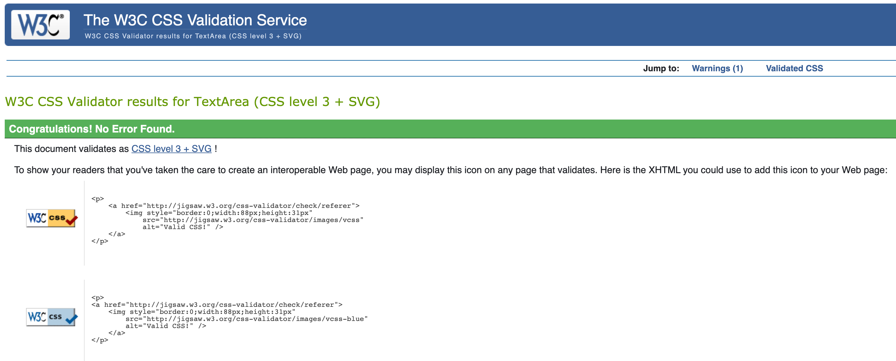
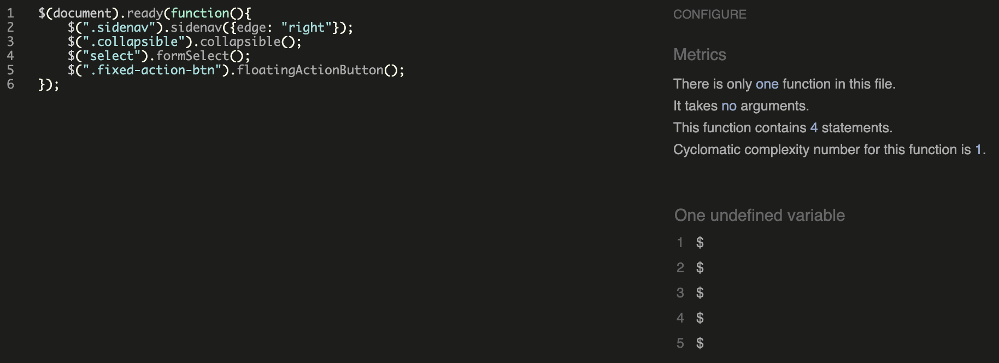
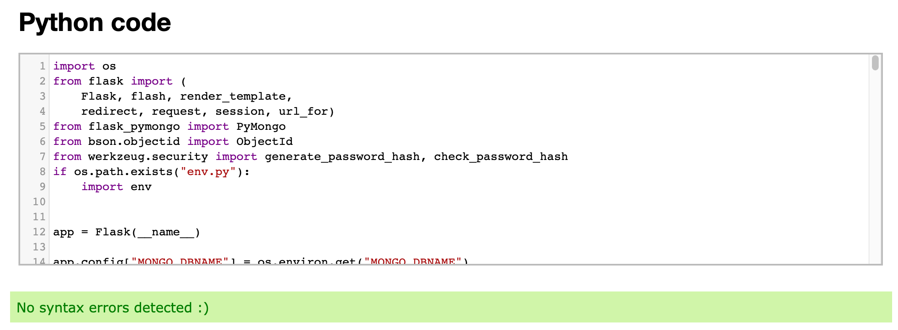
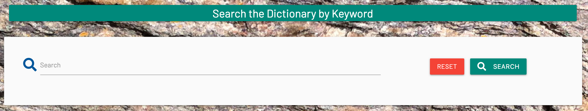
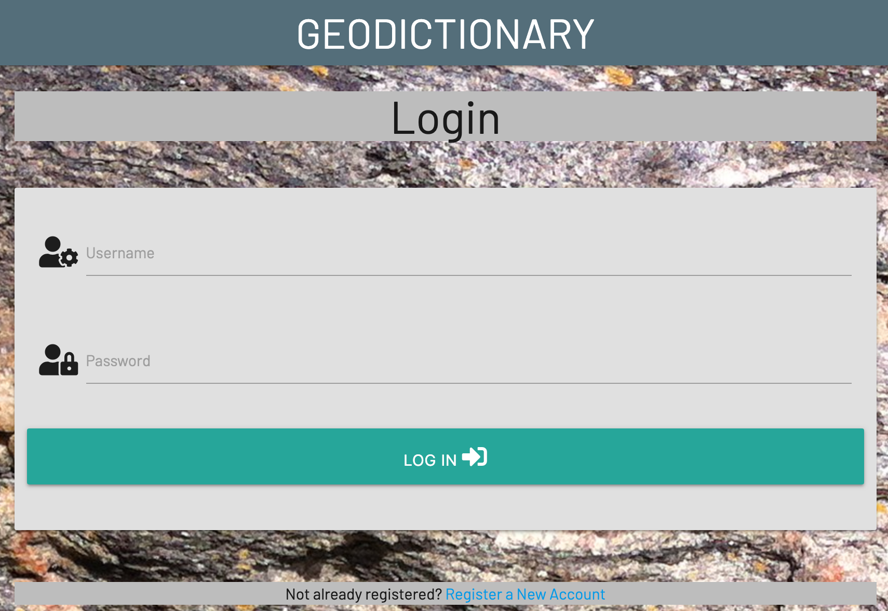
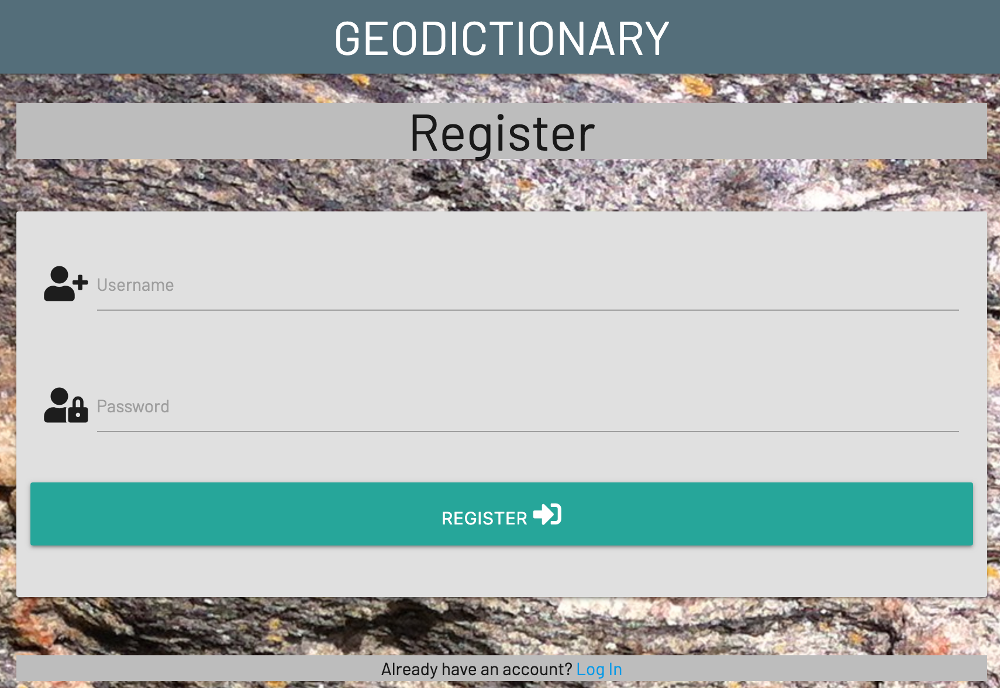
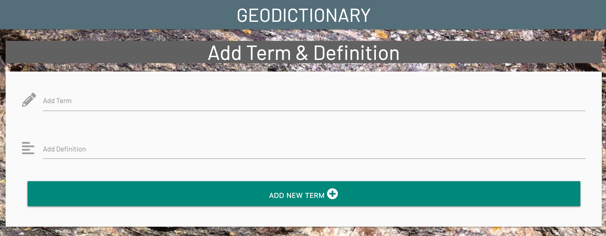

# Table of Contents

> - [User Stories](#user-stories)
> - [Code Validation](#code-validation)
> - [Search Function](#search-function)
> - [Manual Site Testing](#manual-site-testing)
> - [Responsive Tests](#responsive-tests)
> - [Deployment](#deployment)  

## User Stories

### Users

- As a user I want to be presented with a simple, enjoyable and easy to use site, that is also visually appealing

**TESTING:** On first visiting the page, a new user will find themselves on the Home page. They will find a clean and visually appealing page with a top navigation bar containing links to other pages, site hero text, links to browse and search site content, terms and definitions in alphabetical order, and a page footer

- As a user I want to be able to navigate around the site with ease

**TESTING:** Users can easily move around the site by using the navigation bar links which return users to the home page, allow users to log in, or allow users to register. Users can also browse and search site terms and definitions using the alphabet browse function or the search form. An arrow in the right margin allows users to easily navigate up and down the page without having to use scroll bars

- As a user I want to be able to easily find the geological term I am looking for, via an alphabetical ordering system

**TESTING:** As detailed above, users can easily browse site terms and definitions using the alphabet browse function. When a letter is clicked, the page will scroll to the appropriate location.

- As a user I want to be able to easily find the geological term I am looking for, via a search form

**TESTING:** As detailed above, users can easily search for site terms and definitions using the search form. When a keyword(s) are entered into the form, the page will return all terms and definitions containing that keyword(s). The search form also contains a reset button

- As a user I would like the option to add to the dictionary of geological terms

**TESTING:** Users can add terms and definitions to the site only once they have registered an new account. Once registered, the user logs in to their profile where they will now have access to the 'Add Term' link. This link directs users to a form where they can add new terms and definitions to the dictionary

- As a user I want to have access to the geological terms/definitions that I have previously created and have the option to edit them

**TESTING:** Users who have registered have access to edit any terms and definitions which they added to the dictionary. This is achieved by clicking the edit button on each entry they have provided. The edit button is only visible on the entries of that particular user. The edit button directs the user to the edit form where they can perform any edits required

- As a user I want to enjoy using the site enough to want to return

**TESTING:** The site is simple and contains functionality which makes it easy for users to navigate and discover the information they are seeking. These characteristics will make the site attractive for users to visit numerous times

- As a user, going forward I would like to be able to interact with other users on the site on a social level

**TESTING:** The functionality to interact with other users has been included in my 'Features Left to Implement' section in my README file

- As a user, going forward I would like to be able to see recommendations for geological themed merchandise, trips etc

**TESTING:** The functionality to see recommendations has been included in my 'Features Left to Implement' section in my README file

### Admin

- As an admin I would like the ability to **log into an admin account**, so that I can curate and maintain the contents of the site

**TESTING:** The functionality to log in as an admin to curate and maintain the site has been included in my 'Features Left to Implement' section in my README file

- As an admin user I would like the ability to track the activity of registered users so I can monitor the suitability of information being added to the dictionary

**TESTING:** The functionality for an admin to monitor the suitability of information being added been included in my 'Features Left to Implement' section in my README file

- As an admin I would like to be able to delete user accounts, so that I can maintain control of user accounts

**TESTING:** The functionality to delete user accounts has been included in my 'Features Left to Implement' section in my README file

- As an admin I would like to be able to update all terms and definitions so that I can ensure the site is kept relevant, factually correct and visually appealing for all users

**TESTING:** The functionality to update all terms and definitions has been included in my 'Features Left to Implement' section in my README file

> [Back to Top](#table-of-contents) 

## Code Validation

### HTML

Passed code through [Nu Html Checker](https://validator.w3.org/#validate_by_uri)by entering the 'Validate by URI method.

### CSS

Passed code through [W3C CSS Validator](https://jigsaw.w3.org/css-validator/#validate_by_input) by pasting code in by direct input method

- No errors found
- 1 warning - imported style sheets are not checked in direct input and file upload modes - safely ignored.

### JavaScript

Passed code through [JSHint](https://jshint.com/)

- No warning received
- JSHint flags Jquery $ symbol as undefined variable - safely ignored.

### Python

Autopepe8 installed as a dependency for checking code as written
All Python code passed through [ExtendsClass Python Syntax Checker](https://extendsclass.com/python-tester.html)

- [app.py](../../app.py)

> [Back to Top](#table-of-contents) 

## Search Function

The search function for my app is located on the home page. The search function can be used by registered users after they log in to the site, and it can also be used by users without logging on or registering.

- Clicked submit button with no entries in search field - form prompts user to fill in the search field
- Entered valid keyword into search field and page returns relevant result(s)containing that keyword
- Entered invalid keyword and page returns the message: 'No results found'
- Clicked Reset button and this clears the search field to default

> [Back to Top](#table-of-contents) 

## Manual Site Testing

### Navigation

- Checked all navigation links from menu to ensure they direct to relevent pages

### Home page

- Clicked Login link and redirected to Login page
- Clicked Register link and redireced to Register page

### Login page

- Clicked **Log Out** button from Navigation Menu
- Successfully logs user out of their session
- Redirects user to the Home page
- Relevant Flash confirmation message displays correctly

### Register page

- Completed register form fields and successfully registered a new user
- Redirects user to the Profile page
- Relevant Flash confirmation message displays correctly

### Add Term page

- Completed new term and definition form fields and successfully created a new dictionary entry
- Redirects user to the Home page
- Relevant Flash confirmation message displays correctly

### Footer

- Tested all social media icon links to ensure they open correctly in a new browser tab

### Error page

- Entered a series of invalid url suffixes and user is redirected to 404 error page.
- Tested button on 404 error page to ensure it links back to the Home page

> [Back to Top](#table-of-contents)

## Responsive Tests

- DevTools - Devices tested across a range of widths:
  - Mobiles: iPhone5(320px) | Samsung S5 (360px) | iPhone 6/7/8/X (375px) | iPhone 6/7/8 Plus (414px)
  - Tablets: iPad (768px) | iPad Pro (1024px)
  - Desktops: Laptop (1200px) | Large Desktop screen (1920px)

- Viewed on physical devices:
  - Mobiles: small phone (320px) | large phone (414px)
  - Tablets: large tablet (768px)
  - Desktops: Medium laptop (1366px) | Large Desktop screen (1920px)

- Viewed site on on various browsers: >   
  - Google Chrome
  - Mozilla Firefox
  - Opera
  - Apple Safari

  ## Deployment

- Ensured deployed page on Heroku loads up correctly.
- Ensured Debug variable in app.py file is set to False.
- Confirmed that there is no difference between the deployed version and the development version.  

> [Back to Top](#table-of-contents) 